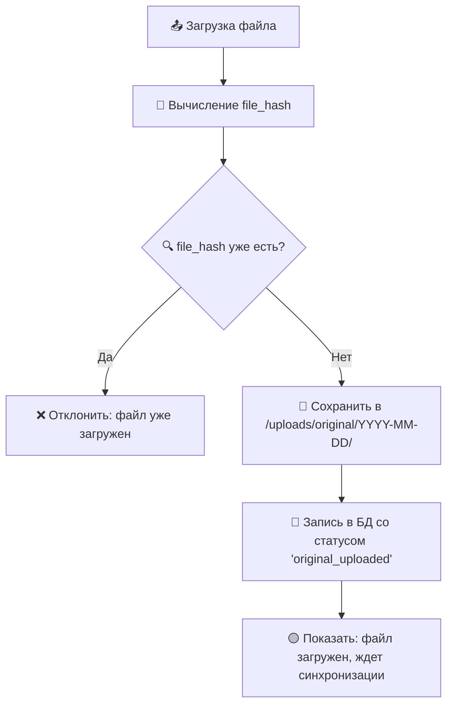
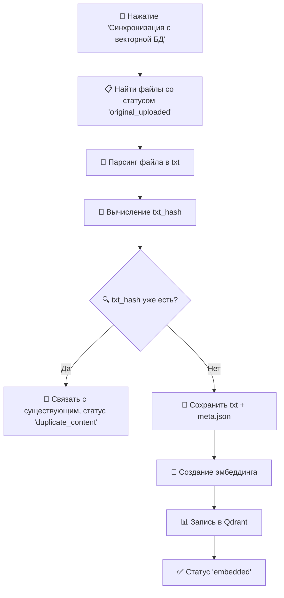

# 🗃️ UPDATED: File Management Plan (декабрь 2024)

## 🎯 Цель: Двухэтапная загрузка с сохранением уникальной библиотеки исходников

> **КЛЮЧЕВОЕ ИЗМЕНЕНИЕ:** Оригинальные файлы теперь сохраняются навсегда как "священные источники" вместо удаления после парсинга.

---

## 🔑 Основные принципы

1. **💎 Сохраняем оригинальные файлы навсегда** (`.pdf`, `.docx`, `.txt`, `.epub`, `.fb2` и др.)
2. **🔐 Двухуровневая дедупликация:**
   - `file_hash` (SHA-256) — против дублей оригинальных файлов
   - `txt_hash` (SHA-256) — против дублей по содержанию текста
3. **📁 Структурированное хранение:** по дате загрузки или хешу
4. **⚡ Разделение процессов:** загрузка → синхронизация (по кнопке)
5. **📊 Прозрачная статистика:** видим количество загруженных и обработанных файлов

---

## 📁 Структура файловой системы

```
/uploads/
├── original/                    # 🔒 Оригинальные файлы (навсегда)
│   ├── 2024-12-15/
│   │   ├── agni-yoga.pdf        # Уникальный по file_hash
│   │   ├── agni-yoga.docx       # Другой формат, тот же текст
│   │   └── bhagavad-gita.epub
│   └── 2024-12-16/
│       └── mahatma-letters.txt
├── txt/                         # 📝 Обработанные txt-файлы
│   ├── a1/
│   │   ├── a1b2c3d4e5.txt      # Уникальный по txt_hash
│   │   └── a1b2c3d4e5.meta.json
│   └── b2/
│       ├── b2c3d4e5f6.txt
│       └── b2c3d4e5f6.meta.json
```

---

## 🗄️ Расширение базы данных

```sql
-- Новые поля для двухэтапной системы
ALTER TABLE processed_files ADD COLUMN txt_hash TEXT;           -- Хеш содержимого txt
ALTER TABLE processed_files ADD COLUMN status TEXT DEFAULT 'original_uploaded';
ALTER TABLE processed_files ADD COLUMN storage_path TEXT;       -- Путь к оригиналу
ALTER TABLE processed_files ADD COLUMN txt_path TEXT;           -- Путь к txt
ALTER TABLE processed_files ADD COLUMN meta_path TEXT;          -- Путь к метаданным
ALTER TABLE processed_files ADD COLUMN embedded_at DATETIME;    -- Дата эмбеддинга

-- Уникальные индексы для дедупликации
CREATE UNIQUE INDEX idx_file_hash ON processed_files(file_hash);
CREATE UNIQUE INDEX idx_txt_hash ON processed_files(txt_hash) WHERE txt_hash IS NOT NULL;
```

**Статусы файлов:**
- `original_uploaded` — загружен оригинал, ждет обработки
- `txt_ready` — txt создан, готов к эмбеддингу  
- `embedded` — эмбеддинг создан, файл в векторной БД
- `duplicate_content` — содержимое дублирует существующий txt_hash

---

## 🔄 Процесс загрузки (этап 1)



---

## ⚡ Процесс синхронизации (этап 2)



---

## 📊 UI и статистика

### Главная страница админки
```
┌─────────────────────────────────────────┐
│  📚 СТАТИСТИКА БИБЛИОТЕКИ               │
├─────────────────────────────────────────┤
│  Загружено файлов:        🔢 512        │
│  Уникальных по содержанию: 🧠 384       │
│  Ожидают синхронизации:   ⏳ 128        │
├─────────────────────────────────────────┤
│  [🔄 Синхронизировать с векторной БД]   │ ← активна если есть pending
└─────────────────────────────────────────┘
```

### Таблица файлов
| Имя файла | Формат | Статус | Загружен | Действия |
|-----------|--------|--------|----------|----------|
| agni-yoga.pdf | PDF | ✅ embedded | 2024-12-15 | [📄 txt] [📁 оригинал] |
| agni-yoga.docx | DOCX | 🔗 duplicate_content | 2024-12-15 | [🔗 связан с #1] |
| bhagavad-gita.epub | EPUB | ⏳ original_uploaded | 2024-12-16 | [⏳ ждет обработки] |

---

## 🎯 Метаданные (.meta.json)

```json
{
  "file_hash": "a1b2c3d4e5f6...",
  "txt_hash": "x1y2z3a4b5c6...",
  "original_filename": "agni-yoga.pdf",
  "original_format": "pdf",
  "title": "Агни Йога",
  "author": "Е.И. Рерих",
  "upload_date": "2024-12-15T10:30:00Z",
  "file_size": 2457600,
  "text_length": 45000,
  "pages": 150,
  "language": "ru",
  "processing_time": 12.5,
  "chunks_created": 156
}
```

---

## 🚀 Преимущества новой системы

- **📚 Уникальная библиотека:** все оригинальные источники сохранены
- **🔄 Гибкость:** можем переобработать файлы в любой момент
- **⚡ Производительность:** эмбеддинг только уникального контента
- **🛡️ Надежность:** защита от потери данных
- **💰 Экономия:** не платим за повторный эмбеддинг дублей
- **📊 Контроль:** полная видимость процесса через UI

---

## 🔧 Технические детали

### Поддерживаемые форматы
- **PDF** → pdf2json (primary), pdf-parse (fallback)
- **DOCX/DOC** → mammoth, word-extractor
- **TXT** → прямое чтение
- **EPUB** → epub парсер
- **FB2** → xml парсер

### Безопасность
- Проверка типа файла по magic bytes
- Ограничение размера (макс. 100MB)
- Санитизация имен файлов
- Проверка на вредоносный контент

### Мониторинг
- Логирование всех операций
- Метрики времени обработки
- Отслеживание ошибок парсинга
- Статистика использования дискового пространства
